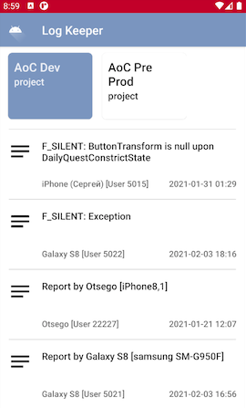

# LogKeeperCompose

Android [Jetpack Compose](https://developer.android.com/jetpack/compose) sample implementation of this [Flutter app](https://github.com/AlexeyPerov/Flutter-Log-Keeper-Tool)
combined with [Firebase Firestore](https://firebase.google.com/docs/firestore)

This app currently contains two screens: list of logs, log details.
Currently, there are only read functions available comparing to the original [app](https://github.com/AlexeyPerov/Flutter-Log-Keeper-Tool). 

## Libraries
- [Jetpack Compose](https://developer.android.com/jetpack/compose)
- [Firebase Firestore](https://firebase.google.com/docs/firestore)
- [ViewModel](https://developer.android.com/topic/libraries/architecture/viewmodel)

You can test it with mock repository but to fully set it up see instructions of the original [app](https://github.com/AlexeyPerov/Flutter-Log-Keeper-Tool) 

## Screenshots

